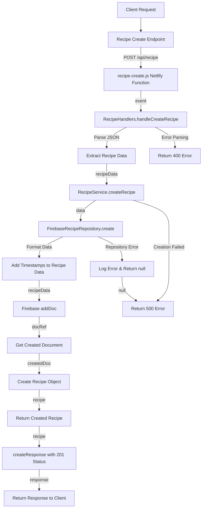

# Recipe Creation Flow

## URL Flow Explanation

1. **Client Request**: The client sends a POST request to create a recipe.
2. **API Gateway**: The request goes through the API gateway to `/api/recipe` endpoint.
3. **Netlify Function**: The request is redirected to the `recipe-create.js` Netlify function via the redirect rule in `netlify.toml`.
4. **Handler Method**: The function calls `RecipeHandlers.handleCreateRecipe()`.
5. **Data Extraction**: The JSON body is parsed to extract recipe data.
6. **Service Layer**: The handler calls `RecipeService.createRecipe()` with the recipe data.
7. **Repository Layer**: The service delegates to `FirebaseRecipeRepository.create()`.
8. **Data Preparation**: Timestamps (createdAt, updatedAt) are added to the recipe data.
9. **Database Operation**: The data is stored in Firebase using `addDoc()`.
10. **Document Retrieval**: The created document is retrieved from Firebase.
11. **Object Creation**: A new Recipe model instance is created with the document data.
12. **Response Creation**: A response with status code 201 is created.
13. **Client Response**: The response is returned to the client.

## Error Handling

- If JSON parsing fails, a 400 error is returned.
- If recipe creation fails at the service level, a 500 error is returned.
- If an error occurs in the repository, it's logged and null is returned, which triggers a 500 error response. 