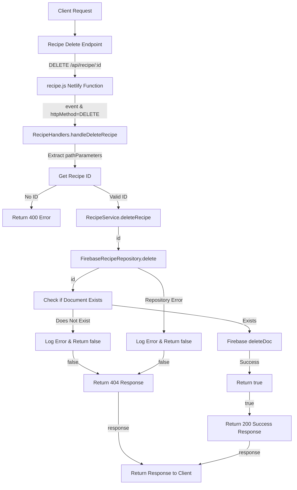

# Recipe Deletion Flow

## URL Flow Explanation

1. **Client Request**: The client sends a DELETE request to remove a specific recipe.
2. **API Gateway**: The request goes through the API gateway to `/api/recipe/:id` endpoint.
3. **Netlify Function**: The request is redirected to the `recipe.js` Netlify function via the redirect rule in `netlify.toml`.
4. **Handler Method**: The function checks the HTTP method is DELETE and calls `RecipeHandlers.handleDeleteRecipe()`.
5. **Parameter Extraction**: The path parameters are extracted to get the recipe ID.
6. **Validation**: The handler validates that an ID was provided.
7. **Service Layer**: If valid, the handler calls `RecipeService.deleteRecipe()` with the ID.
8. **Repository Layer**: The service delegates to `FirebaseRecipeRepository.delete()`.
9. **Document Check**: The code first checks if the document exists before deletion.
10. **Database Operation**: If it exists, the document is deleted from Firebase using `deleteDoc()`.
11. **Success Confirmation**: The repository returns a boolean indicating success.
12. **Response Creation**: Based on the success value:
    - If true: A response with status code 200 is created with a success message.
    - If false: A response with status code 404 is created with an error message.
13. **Client Response**: The response is returned to the client.

## Error Handling

- If recipe ID is missing, a 400 error is returned.
- If the document doesn't exist before deletion, a 404 error is returned.
- If an error occurs in the repository, it's logged and false is returned, which triggers a 404 response. 