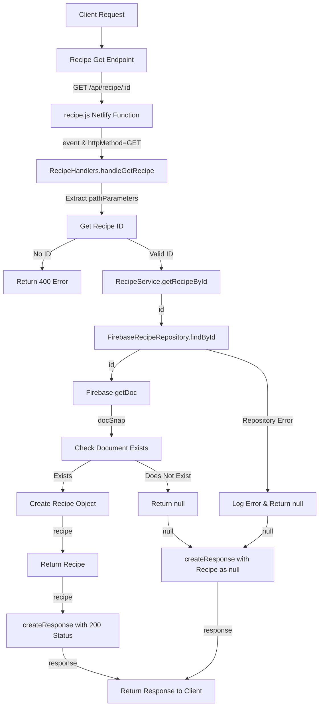

# Recipe Fetching Flow

## URL Flow Explanation

1. **Client Request**: The client sends a GET request to fetch a specific recipe.
2. **API Gateway**: The request goes through the API gateway to `/api/recipe/:id` endpoint.
3. **Netlify Function**: The request is redirected to the `recipe.js` Netlify function via the redirect rule in `netlify.toml`.
4. **Handler Method**: The function checks the HTTP method is GET and calls `RecipeHandlers.handleGetRecipe()`.
5. **Parameter Extraction**: The path parameters are extracted to get the recipe ID.
6. **Validation**: The handler validates that an ID was provided.
7. **Service Layer**: If valid, the handler calls `RecipeService.getRecipeById()` with the ID.
8. **Repository Layer**: The service delegates to `FirebaseRecipeRepository.findById()`.
9. **Database Operation**: The document is retrieved from Firebase using `getDoc()`.
10. **Document Check**: The code checks if the requested document exists.
11. **Object Creation**: If it exists, a new Recipe model instance is created with the document data.
12. **Response Creation**: A response with status code 200 is created, containing the recipe data.
13. **Client Response**: The response is returned to the client.

## Error Handling

- If recipe ID is missing, a 400 error is returned.
- If the document doesn't exist, null is returned in the response with a 200 status code.
- If an error occurs in the repository, it's logged and null is returned in the response. 