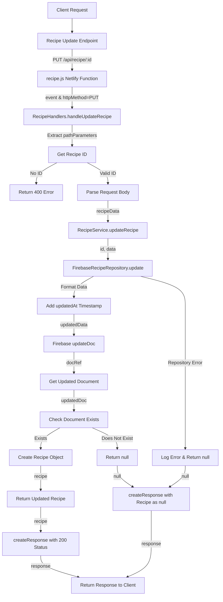

# Recipe Update Flow

## URL Flow Explanation

1. **Client Request**: The client sends a PUT request to update a specific recipe.
2. **API Gateway**: The request goes through the API gateway to `/api/recipe/:id` endpoint.
3. **Netlify Function**: The request is redirected to the `recipe.js` Netlify function via the redirect rule in `netlify.toml`.
4. **Handler Method**: The function checks the HTTP method is PUT and calls `RecipeHandlers.handleUpdateRecipe()`.
5. **Parameter Extraction**: The path parameters are extracted to get the recipe ID.
6. **Validation**: The handler validates that an ID was provided.
7. **Data Parsing**: The JSON body is parsed to extract recipe update data.
8. **Service Layer**: The handler calls `RecipeService.updateRecipe()` with the ID and data.
9. **Repository Layer**: The service delegates to `FirebaseRecipeRepository.update()`.
10. **Data Preparation**: The current timestamp is added to the updatedAt field.
11. **Database Operation**: The document is updated in Firebase using `updateDoc()`.
12. **Document Retrieval**: The updated document is retrieved from Firebase.
13. **Document Check**: The code checks if the document exists after update.
14. **Object Creation**: If it exists, a new Recipe model instance is created with the updated document data.
15. **Response Creation**: A response with status code 200 is created, containing the updated recipe.
16. **Client Response**: The response is returned to the client.

## Error Handling

- If recipe ID is missing, a 400 error is returned.
- If the document doesn't exist after update, null is returned.
- If an error occurs in the repository, it's logged and null is returned. 