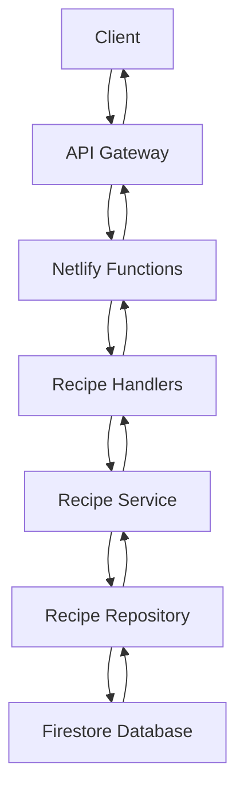

# Recipe URL Flow Overview

This document provides a comprehensive overview of how recipe URLs are created, processed, and passed through different components of the API Gateway system.

## URL Structure

The API Gateway exposes the following recipe-related endpoints:

```
GET    /api/recipes              - List all recipes (paginated)
GET    /api/recipes/random       - Get random recipes
GET    /api/recipes/search?q=... - Search for recipes
GET    /api/recipe/:id           - Get a specific recipe
POST   /api/recipe               - Create a new recipe
PUT    /api/recipe/:id           - Update a specific recipe
DELETE /api/recipe/:id           - Delete a specific recipe
```

## Routing Process

1. **Client Requests**: All API requests start with the `/api/` prefix.
2. **Netlify Redirect**: The `netlify.toml` configuration redirects these requests to the corresponding Netlify Functions:
   ```
   [[redirects]]
     from = "/api/*"
     to = "/.netlify/functions/:splat"
     status = 200
   ```
3. **Function Routing**: The request is routed to the appropriate Netlify Function based on the URL pattern:
   - `/api/recipes` → `recipes.js`
   - `/api/recipes/random` → `recipes-random.js`
   - `/api/recipes/search` → `recipes-search.js` 
   - `/api/recipe` (POST) → `recipe-create.js`
   - `/api/recipe/:id` (GET, PUT, DELETE) → `recipe.js`

## Component Interactions



## Layer Responsibilities

1. **Netlify Functions** (`netlify/functions/`):
   - Entry points for HTTP requests
   - Route to appropriate handler method based on HTTP method
   - Catch and handle top-level errors

2. **Handlers** (`app/handlers/recipeHandlers.js`):
   - Extract parameters from the request
   - Validate input data
   - Call appropriate service methods
   - Format the HTTP response

3. **Service** (`app/services/RecipeService.js`):
   - Business logic layer
   - Abstracts away data access
   - Acts as a facade to the repository

4. **Repository** (`app/repositories/FirebaseRecipeRepository.js`):
   - Data access layer
   - Communicates with Firestore
   - Converts between database documents and Recipe model objects

5. **Model** (`app/models/Recipe.js`):
   - Represents the recipe data structure
   - Provides data validation
   - Offers serialization methods

## URL Flow Diagrams

Detailed flow diagrams for each operation are available in separate files:

- [Recipe List Flow](./recipes-list-flow.md)
- [Random Recipes Flow](./recipes-random-flow.md)
- [Recipe Search Flow](./recipes-search-flow.md)
- [Get Recipe Flow](./recipe-get-flow.md)
- [Create Recipe Flow](./recipe-create-flow.md)
- [Update Recipe Flow](./recipe-update-flow.md)
- [Delete Recipe Flow](./recipe-delete-flow.md) 