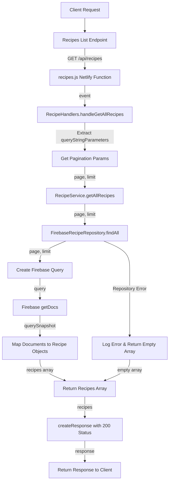

# Recipes Listing Flow

## URL Flow Explanation

1. **Client Request**: The client sends a GET request to fetch all recipes with pagination.
2. **API Gateway**: The request goes through the API gateway to `/api/recipes` endpoint.
3. **Netlify Function**: The request is redirected to the `recipes.js` Netlify function via the redirect rule in `netlify.toml`.
4. **Handler Method**: The function calls `RecipeHandlers.handleGetAllRecipes()`.
5. **Parameter Extraction**: The query string parameters are extracted to get pagination info (page, limit).
6. **Service Layer**: The handler calls `RecipeService.getAllRecipes()` with the pagination parameters.
7. **Repository Layer**: The service delegates to `FirebaseRecipeRepository.findAll()`.
8. **Query Creation**: A Firebase query is created with pagination and ordering parameters.
9. **Database Operation**: The documents are retrieved from Firebase using `getDocs()`.
10. **Object Mapping**: Each document is mapped to a Recipe model instance.
11. **Response Creation**: A response with status code 200 is created, containing the array of recipes.
12. **Client Response**: The response is returned to the client.

## Error Handling

- If an error occurs in the repository, it's logged and an empty array is returned.
- Default values are used for pagination if not provided (page=1, limit=10). 