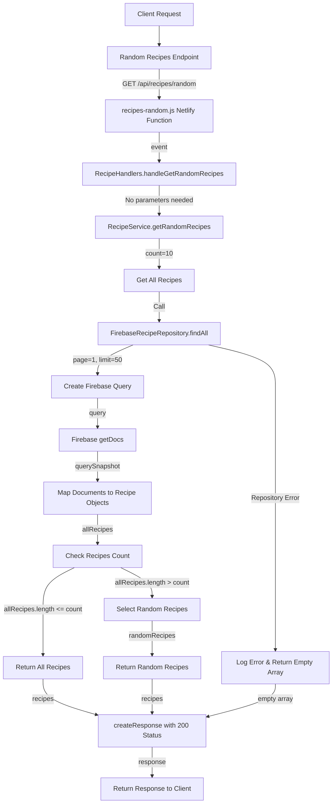

# Random Recipes Flow

## URL Flow Explanation

1. **Client Request**: The client sends a GET request to fetch random recipes.
2. **API Gateway**: The request goes through the API gateway to `/api/recipes/random` endpoint.
3. **Netlify Function**: The request is redirected to the `recipes-random.js` Netlify function via the redirect rule in `netlify.toml`.
4. **Handler Method**: The function calls `RecipeHandlers.handleGetRandomRecipes()`.
5. **Service Layer**: The handler calls `RecipeService.getRandomRecipes()` with a count of 10.
6. **Repository Call**: The service retrieves all recipes by calling `FirebaseRecipeRepository.findAll()`.
7. **Query Creation**: A Firebase query is created to fetch a larger set of recipes (50).
8. **Database Operation**: The documents are retrieved from Firebase using `getDocs()`.
9. **Object Mapping**: Each document is mapped to a Recipe model instance.
10. **Count Check**: The code checks if we have fewer recipes than requested.
11. **Random Selection**: If we have more recipes than requested, randomly select the required number.
12. **Response Creation**: A response with status code 200 is created, containing the array of random recipes.
13. **Client Response**: The response is returned to the client.

## Error Handling

- If an error occurs in the repository, it's logged and an empty array is returned.
- If fewer recipes exist than requested, all available recipes are returned. 