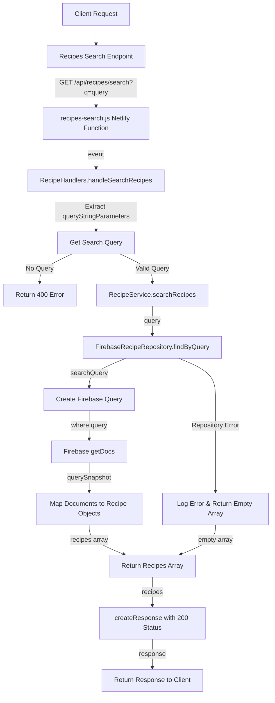

# Recipe Search Flow

## URL Flow Explanation

1. **Client Request**: The client sends a GET request to search for recipes with a query string.
2. **API Gateway**: The request goes through the API gateway to `/api/recipes/search` endpoint.
3. **Netlify Function**: The request is redirected to the `recipes-search.js` Netlify function via the redirect rule in `netlify.toml`.
4. **Handler Method**: The function calls `RecipeHandlers.handleSearchRecipes()`.
5. **Parameter Extraction**: The query string parameters are extracted to get the search query.
6. **Validation**: The handler validates that a search query was provided.
7. **Service Layer**: If valid, the handler calls `RecipeService.searchRecipes()` with the query.
8. **Repository Layer**: The service delegates to `FirebaseRecipeRepository.findByQuery()`.
9. **Query Creation**: A Firebase query is created with filters on the title field.
10. **Database Operation**: The documents are retrieved from Firebase using `getDocs()`.
11. **Object Mapping**: Each document is mapped to a Recipe model instance.
12. **Response Creation**: A response with status code 200 is created, containing the array of matching recipes.
13. **Client Response**: The response is returned to the client.

## Error Handling

- If search query parameter is missing, a 400 error is returned.
- If an error occurs in the repository, it's logged and an empty array is returned. 